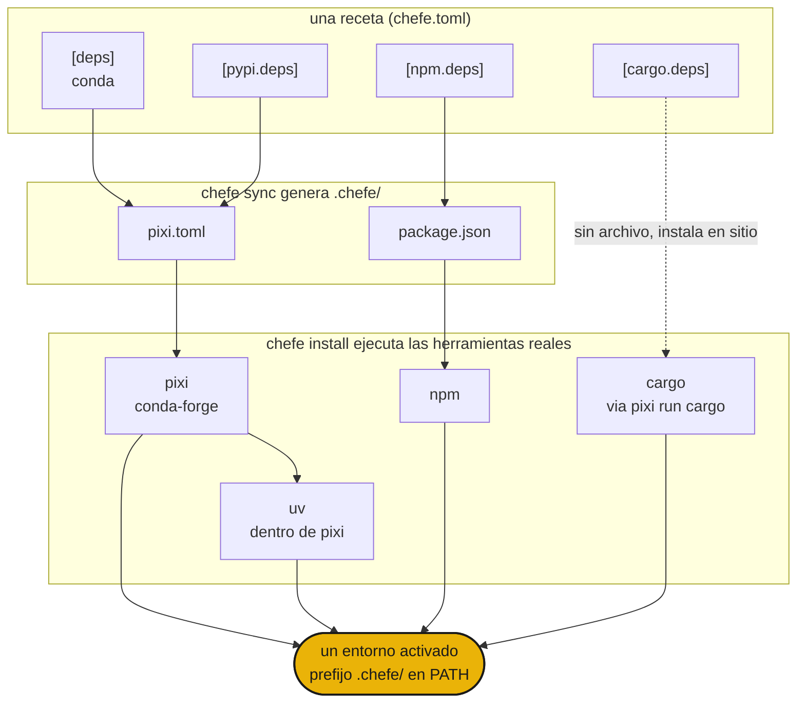

# Cómo funciona

`chefe sync` compila tu único `chefe.toml` en los manifests nativos dentro de `.chefe/`, y luego `chefe install` le entrega cada uno a la herramienta real para que resuelvan y construyan un solo entorno compartido.



- La **estructura** la valida el esquema de chefe, mientras que los **specs de paquetes** siguen siendo tarea de cada herramienta.
- Editar `chefe.toml` a través de `chefe add` y `chefe remove` conserva tus comentarios y formato.
- `pixi` (con `uv` dentro) es el motor profundo para conda y PyPI, y los demás ecosistemas son capas delgadas y explícitas por encima.

## Inicio rápido

```sh
chefe init                 # scaffold a chefe.toml
chefe add ripgrep          # add deps, use --pypi / --cargo / --npm for others
chefe install              # provision every ecosystem at once
chefe tree                 # what's declared vs installed, per ecosystem
```

A continuación, la [referencia del manifest](manifest.md) y la [referencia de comandos](commands.md).
