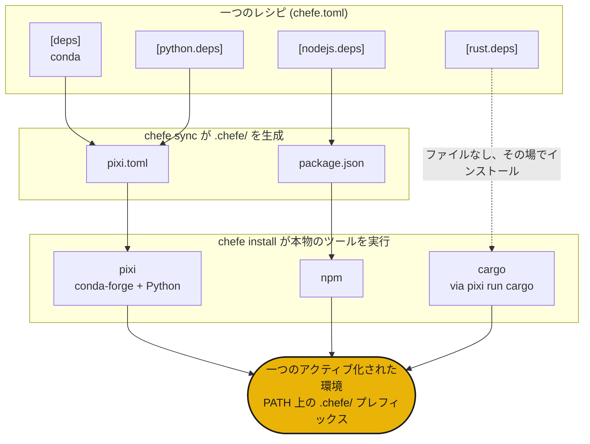

# 仕組み

`chefe sync` は一つの `chefe.toml` を `.chefe/` 配下のネイティブマニフェストへコンパイルし、続いて `chefe install` がそれぞれを本物のツールに渡して、解決と単一の共有環境のビルドを行わせます。



- **構造** は chefe のスキーマによって検証され、**パッケージ仕様** は各ツールの仕事のままです。
- `chefe add` と `chefe remove` を通じて `chefe.toml` を編集すると、コメントと書式が保たれます。
- `pixi` は conda と Python packages のための深いエンジンであり、他のlanguage/toolchainはその上に重なる薄く明示的なレイヤーです。

## クイックスタート

```sh
chefe init                 # scaffold a chefe.toml
chefe add ripgrep          # conda is the default resolver
chefe add torch -l python
chefe add prettier -l nodejs
chefe install              # provision every language/toolchain at once
chefe tree                 # what's declared vs installed, per language/toolchain
```

次は [マニフェストリファレンス](manifest.md) と [コマンドリファレンス](commands.md) です。
