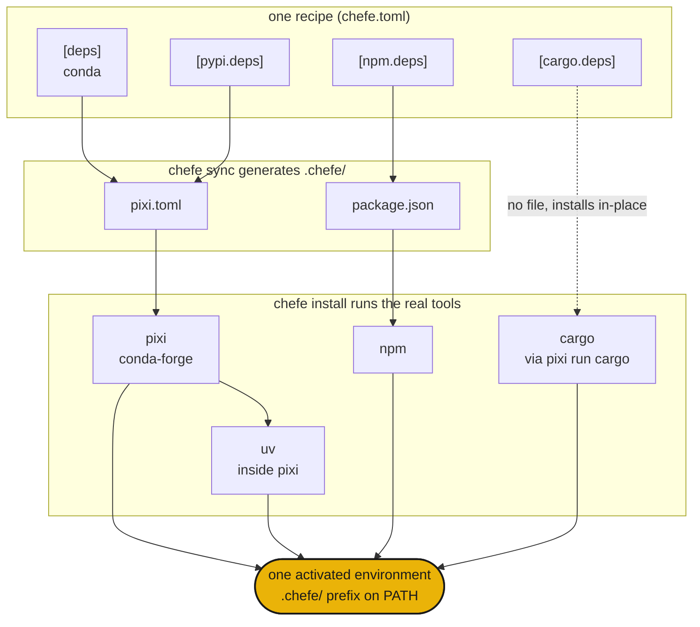

# How it works

`chefe sync` compiles your one `chefe.toml` into the native manifests under `.chefe/`, then `chefe install` hands each one to the real tool so they solve and build a single shared environment.



- **Structure** is validated by chefe's schema, while **package specs** stay each tool's job.
- Editing `chefe.toml` through `chefe add` and `chefe remove` keeps your comments and formatting.
- `pixi` (with `uv` inside it) is the deep engine for conda and PyPI, and the other ecosystems are thin, explicit layers on top.

## Quickstart

```sh
chefe init                 # scaffold a chefe.toml
chefe add ripgrep          # add deps, use --pypi / --cargo / --npm for others
chefe install              # provision every ecosystem at once
chefe tree                 # what's declared vs installed, per ecosystem
```

Next, the [manifest reference](manifest.md) and the [command reference](commands.md).
