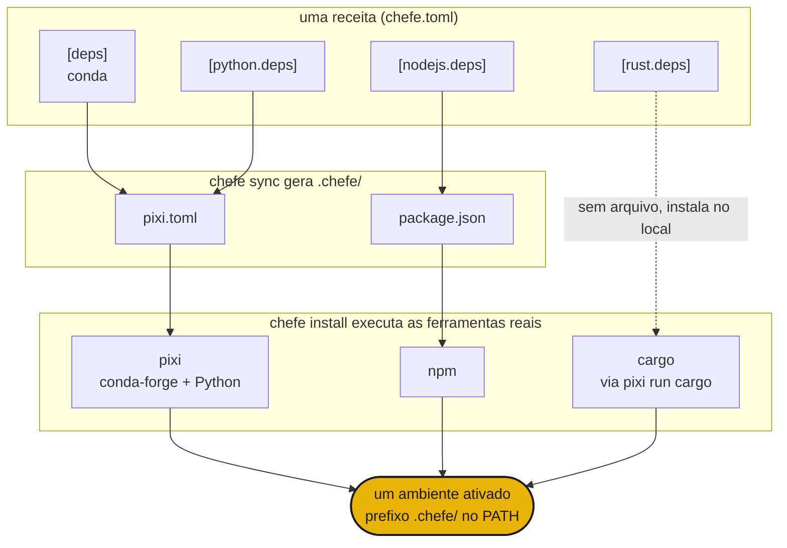

# Como funciona

O `chefe sync` compila seu único `chefe.toml` nos manifests nativos dentro de `.chefe/`, e então o `chefe install` entrega cada um à ferramenta real, para que elas resolvam e construam um único ambiente compartilhado.



- A **estrutura** é validada pelo schema do chefe, enquanto as **especificações de pacotes** continuam sendo trabalho de cada ferramenta.
- Editar o `chefe.toml` através do `chefe add` e do `chefe remove` preserva seus comentários e sua formatação.
- O `pixi` é o motor profundo para conda e Python packages, e os outros linguagens/toolchains são camadas finas e explícitas por cima.

## Início rápido

```sh
chefe init                 # scaffold a chefe.toml
chefe add ripgrep          # conda is the default resolver
chefe add torch -l python
chefe add prettier -l nodejs
chefe install              # provision every language/toolchain at once
chefe tree                 # what's declared vs installed, per language/toolchain
```

A seguir, a [referência do manifest](manifest.md) e a [referência de comandos](commands.md).
