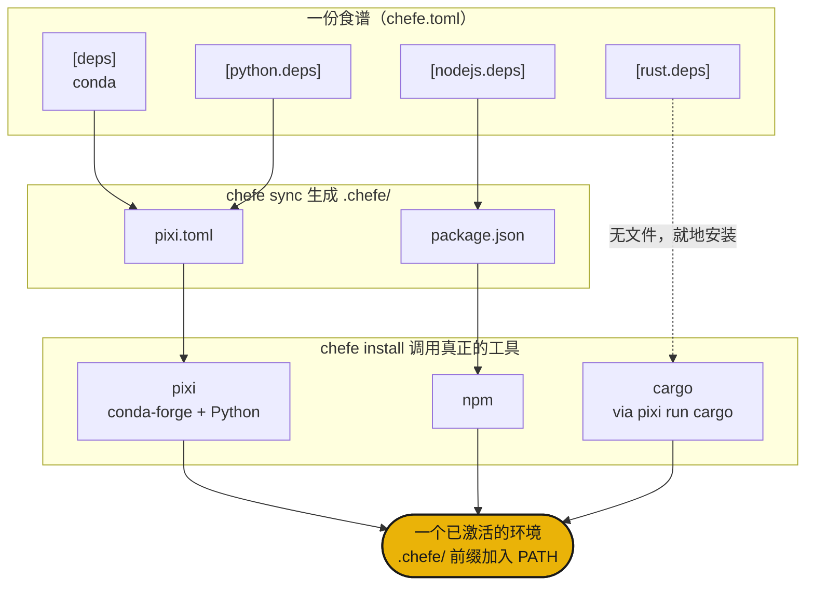

# 工作原理

`chefe sync` 把你那一份 `chefe.toml` 编译成 `.chefe/` 下的原生 manifest，接着 `chefe install` 把每一份交给真正的工具，由它们求解并构建出一个共享的统一环境。



- **结构**由 chefe 的 schema 校验，而**包规格说明**始终是各工具自己的职责。
- 通过 `chefe add` 和 `chefe remove` 编辑 `chefe.toml` 会保留你的注释和格式。
- `pixi` 是 conda 和 Python packages 的底层引擎，其他language/toolchain则是其上轻薄而显式的一层。

## 快速上手

```sh
chefe init                 # scaffold a chefe.toml
chefe add ripgrep          # conda is the default resolver
chefe add torch -l python
chefe add prettier -l nodejs
chefe install              # provision every language/toolchain at once
chefe tree                 # what's declared vs installed, per language/toolchain
```

接下来请看 [manifest 参考](manifest.md) 和 [命令参考](commands.md)。
