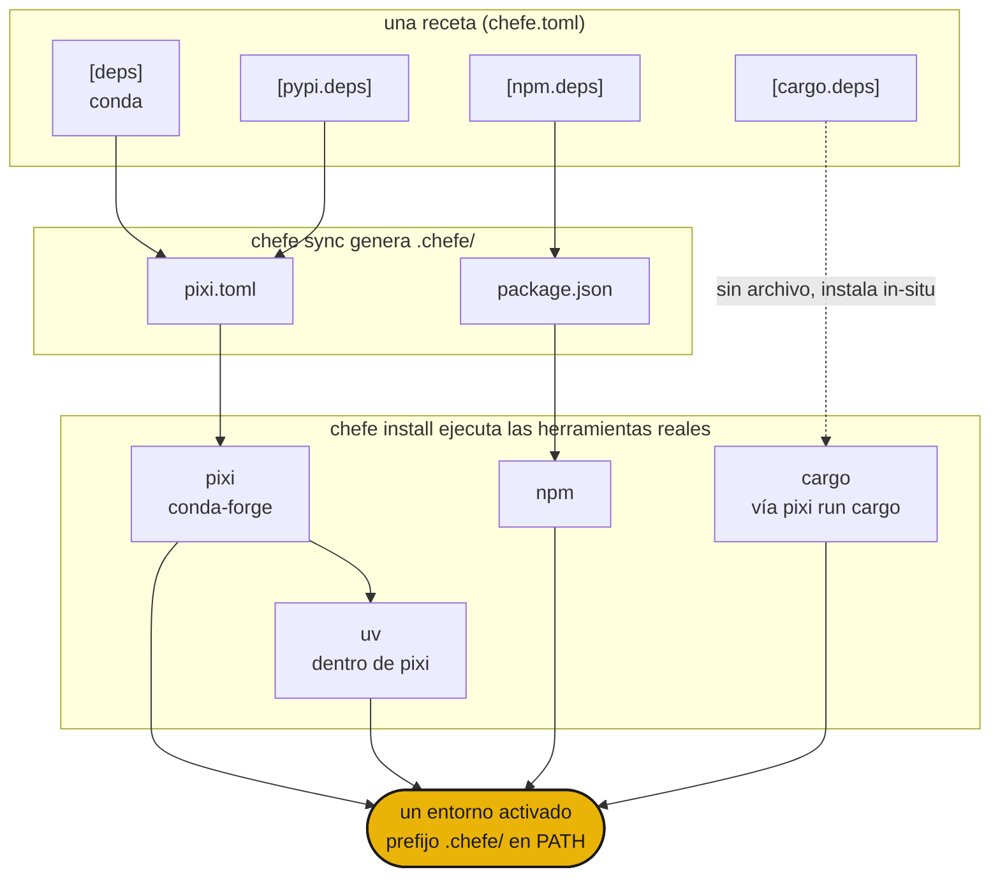

<div class="hero" markdown>

{ .hero-banner }

# chefe { .visually-hidden }

</div>

## Instalación

```sh
curl -fsSL https://phvv.me/chefe/install.sh | sh
```

Esto instala [pixi](https://pixi.sh) (el motor al que compila chefe) y el propio chefe. ¿Prefieres el paquete original? Usa `pip install chefe` o `uv tool install chefe`.

## Qué es

Conda, PyPI, npm, cargo. Los proyectos reales necesitan varios a la vez, dispersos entre `pixi.toml`, `package.json` y `Cargo.toml`. chefe es el jefe de cocina. Tú escribes **una receta `chefe.toml`**, él compila cada manifest nativo bajo `.chefe/`, ejecuta las herramientas reales y los sirve como un entorno único. Nunca vuelve a implementar un resolvedor. Él dirige a los cocineros.

<div class="grid cards" markdown>

- :material-silverware-variant: **Una receta**

    Cada ecosistema en un solo `chefe.toml`. Se acabó el hacer malabares con cuatro manifests.

- :material-cog-transfer-outline: **Salida nativa**

    Compila a `pixi.toml`, `package.json` y similares reales. Las herramientas reales hacen la resolución.

- :material-source-branch: **Componible**

    Las superposiciones de plataforma y los entornos con nombre se apilan como las características de pixi.

- :material-broom: **Autocontenido**

    Todo el entorno vive en `.chefe/`, por lo que un comando lo elimina por completo.

</div>

!!! warning "chefe está en fase temprana (`0.0.x`)"
    El formato del manifest y los comandos aún pueden cambiar.

## Inicio rápido

```sh
chefe init                 # crea la estructura de un chefe.toml
chefe add ripgrep          # añade dependencias, usa --pypi / --cargo / --npm para otras
chefe install              # aprovisiona cada ecosistema a la vez
chefe tree                 # qué está declarado frente a qué está instalado, por ecosistema
```

## Cómo encaja todo



- La **estructura** es validada por el esquema de chefe, mientras que las **especificaciones de los paquetes** siguen siendo trabajo de cada herramienta.
- Editar `chefe.toml` a través de `chefe add` y `chefe remove` mantiene tus comentarios y formato.
- `pixi` (con `uv` dentro) es el motor profundo para conda y PyPI, y los otros ecosistemas son capas delgadas y explícitas encima.

A continuación, la [referencia del manifest](manifest.md) y la [referencia de comandos](commands.md).

## Historia

Un jefe de cocina nunca cocina cada plato solo. Escribe la receta y dirige la línea, y los cocineros trabajan cada uno en su estación. Los gestores de paquetes dispersos son esa línea, así que chefe los dirige desde una sola receta. 🧑‍🍳