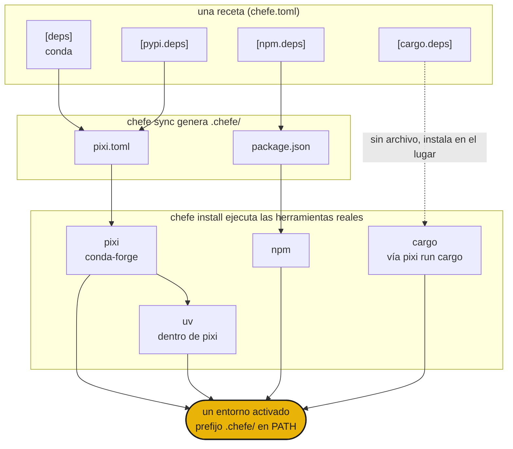

# chefe

Un manifest para cada gestor de paquetes

## Instalación

```sh
curl -fsSL https://phvv.me/chefe/install.sh | sh
```

Esto instala [pixi](https://pixi.sh) (el motor al que chefe compila) y chefe en sí. ¿Prefieres el paquete sin más? Usa `pip install chefe` o `uv tool install chefe`.

## Qué es

Conda, PyPI, npm, cargo. Los proyectos reales necesitan varios a la vez, dispersos entre `pixi.toml`, `package.json` y `Cargo.toml`. chefe es el chef ejecutivo. Escribes **un solo `chefe.toml`** como receta, compila cada manifest nativo dentro de `.chefe/`, ejecuta las herramientas reales y las emplata como un único entorno. Nunca reimplementa un solver. Dirige a los cocineros.

<div class="grid cards" markdown>

- :material-silverware-variant: **Una sola receta**

    Cada ecosistema en un solo `chefe.toml`. Se acabó hacer malabares con cuatro manifests.

- :material-cog-transfer-outline: **Salida nativa**

    Compila a `pixi.toml`, `package.json` y compañía reales. Las herramientas de verdad hacen la resolución.

- :material-source-branch: **Componible**

    Las superposiciones por plataforma y los entornos con nombre se apilan como los features de pixi.

- :material-broom: **Autocontenido**

    Todo el entorno vive en `.chefe/`, así que un solo comando lo borra.

</div>

!!! warning "chefe está en una etapa temprana (`0.0.x`)"
    El formato del manifest y los comandos aún pueden cambiar.

## Inicio rápido

```sh
chefe init                 # scaffold a chefe.toml
chefe add ripgrep          # add deps, use --pypi / --cargo / --npm for others
chefe install              # provision every ecosystem at once
chefe tree                 # what's declared vs installed, per ecosystem
```

## Cómo encaja todo



- La **estructura** la valida el esquema de chefe, mientras que las **especificaciones de paquetes** siguen siendo tarea de cada herramienta.
- Editar `chefe.toml` mediante `chefe add` y `chefe remove` conserva tus comentarios y formato.
- `pixi` (con `uv` dentro) es el motor profundo para conda y PyPI, y los demás ecosistemas son capas finas y explícitas por encima.

A continuación, la [referencia del manifest](manifest.md) y la [referencia de comandos](commands.md).

## Trasfondo

Un chef ejecutivo nunca cocina cada plato solo. Escribe la receta y dirige la cocina, y cada cocinero trabaja en su estación. Los gestores de paquetes dispersos son esa cocina, así que chefe los dirige desde una sola receta. 🧑‍🍳
