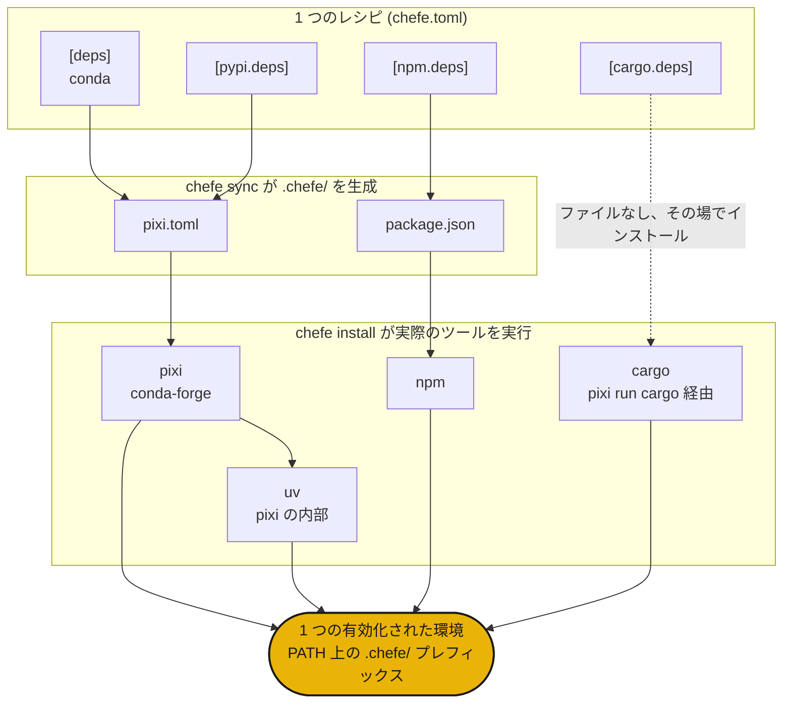

# chefe

すべてのパッケージマネージャーを一つのマニフェストで

## インストール

```sh
curl -fsSL https://phvv.me/chefe/install.sh | sh
```

これにより [pixi](https://pixi.sh)（chefe がコンパイル先とするエンジン）と chefe 本体がインストールされます。素のパッケージが欲しい場合は、`pip install chefe` または `uv tool install chefe` を使ってください。

## chefe とは

Conda、PyPI、npm、cargo。実際のプロジェクトではこれらが同時にいくつも必要になり、`pixi.toml`、`package.json`、`Cargo.toml` に散らばってしまいます。chefe はそのヘッドシェフです。**一つの `chefe.toml`** というレシピを書けば、`.chefe/` 配下に各ネイティブマニフェストをコンパイルし、本物のツールを実行し、それらを単一の環境として盛り付けます。ソルバーを自前で再実装することは決してありません。コックたちに働いてもらうのです。

<div class="grid cards" markdown>

- :material-silverware-variant: **一つのレシピ**

    あらゆるエコシステムを単一の `chefe.toml` にまとめます。もう四つのマニフェストを掛け持ちする必要はありません。

- :material-cog-transfer-outline: **ネイティブな出力**

    本物の `pixi.toml`、`package.json` などにコンパイルします。解決は実際のツールが行います。

- :material-source-branch: **組み合わせ可能**

    プラットフォームオーバーレイと名前付き環境が、pixi の feature のように積み重なります。

- :material-broom: **自己完結**

    環境全体が `.chefe/` 内に収まるので、一つのコマンドで一掃できます。

</div>

!!! warning "chefe はまだ初期段階です（`0.0.x`）"
    マニフェスト形式とコマンドは今後も変わる可能性があります。

## クイックスタート

```sh
chefe init                 # scaffold a chefe.toml
chefe add ripgrep          # add deps, use --pypi / --cargo / --npm for others
chefe install              # provision every ecosystem at once
chefe tree                 # what's declared vs installed, per ecosystem
```

## 全体の組み合わせ方



- **構造** は chefe のスキーマで検証され、**パッケージ仕様** は引き続き各ツールが受け持ちます。
- `chefe add` や `chefe remove` を通じて `chefe.toml` を編集しても、コメントやフォーマットはそのまま保たれます。
- `pixi`（その内部に `uv` を内包）は conda と PyPI を支える中核エンジンであり、他のエコシステムはその上に乗る薄く明示的なレイヤーです。

次は、[マニフェストリファレンス](manifest.md)と[コマンドリファレンス](commands.md)へ。

## 由来

ヘッドシェフがすべての料理を一人で作ることはありません。レシピを書いてライン全体を指揮し、各コックがそれぞれの持ち場で働きます。散らばったパッケージマネージャーはまさにそのラインであり、chefe は一つのレシピからそれらを指揮します。🧑‍🍳
