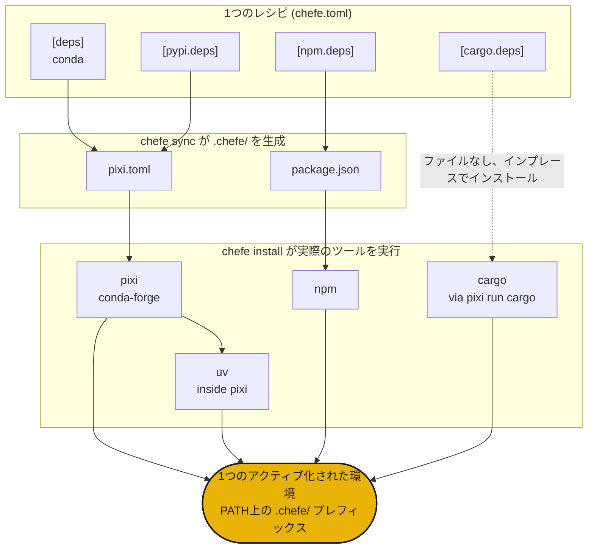

<div class="hero" markdown>

{ .hero-banner }

</div>

## インストール

```sh
curl -fsSL https://phvv.me/chefe/install.sh | sh
```

これにより、[pixi](https://pixi.sh)（chefeがコンパイル先とするエンジン）とchefe自身がインストールされます。生のパッケージをご希望ですか？ `pip install chefe` または `uv tool install chefe` を使用してください。

## chefeとは

Conda、PyPI、npm、cargo。実際のプロジェクトでは、これらを同時にいくつも使用する必要があり、`pixi.toml`、`package.json`、`Cargo.toml` に散らばってしまいます。chefeは「ヘッドシェフ」です。あなたは**1つの `chefe.toml`** レシピを書くだけで、chefeが `.chefe/` 配下に各ネイティブの manifest をコンパイルし、実際のツールを実行して、単一の環境として提供します。chefeはソルバーを再実装することはありません。料理人（各ツール）を指揮するのです。

<div class="grid cards" markdown>

- :material-silverware-variant: **1つのレシピ**

    すべてのエコシステムを1つの `chefe.toml` に集約。4つの manifest をやりくりする必要はもうありません。

- :material-cog-transfer-outline: **ネイティブな出力**

    実際の `pixi.toml`、`package.json` などにコンパイルされます。実際のツールが解決（solving）を行います。

- :material-source-branch: **構成可能**

    プラットフォームのオーバーレイや名前付き環境は、pixiの機能のようにスタック可能です。

- :material-broom: **自己完結型**

    環境全体が `.chefe/` 内に存在するため、1つのコマンドで完全に削除できます。

</div>

!!! warning "chefeは初期段階です (`0.0.x`)"
    manifest の形式やコマンドは今後変更される可能性があります。

## クイックスタート

```sh
chefe init                 # chefe.toml の雛形を作成
chefe add ripgrep          # 依存関係を追加（他には --pypi / --cargo / --npm を使用）
chefe install              # すべてのエコシステムを一度にプロビジョニング
chefe tree                 # エコシステムごとに、宣言内容とインストール済みパッケージを表示
```

## 仕組み



- **構造**はchefeのスキーマによって検証され、**パッケージの仕様**は各ツールの役割のままです。
- `chefe add` や `chefe remove` を通じて `chefe.toml` を編集しても、コメントやフォーマットは維持されます。
- `pixi`（内部に `uv` を含む）がCondaとPyPIの強力なエンジンとなり、他のエコシステムはその上に薄く明示的なレイヤーとして存在します。

次は、[manifest リファレンス](manifest.md) と [コマンドリファレンス](commands.md) をご覧ください。

## 由来

ヘッドシェフは決してすべての料理を一人で作ることはありません。レシピを書き、現場を指揮し、料理人たちがそれぞれの持ち場で働きます。散らばったパッケージマネージャーがその現場であり、chefeは1つのレシピからそれらを指揮するのです。🧑‍🍳