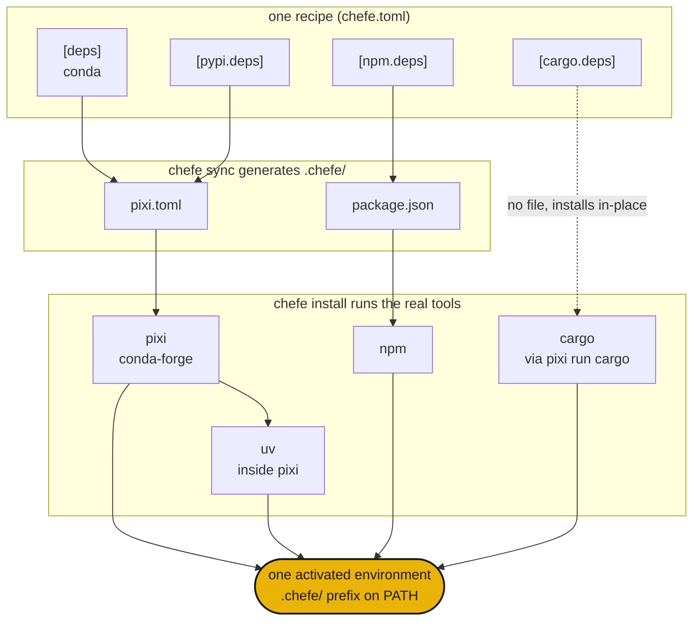

<div class="hero" markdown>

{ .hero-banner }

# chefe { .visually-hidden }

</div>

## Installation

```sh
curl -fsSL https://phvv.me/chefe/install.sh | sh
```

This installs [pixi](https://pixi.sh) (the engine chefe compiles to) and chefe itself. Prefer the raw package? Use `pip install chefe` or `uv tool install chefe`.

## What it is

Conda, PyPI, npm, cargo. Real projects need several at once, scattered across `pixi.toml`, `package.json`, and `Cargo.toml`. chefe is the head chef. You write **one `chefe.toml`** recipe, it compiles each native manifest under `.chefe/`, runs the real tools, and plates them as a single environment. It never re-implements a solver. It runs the cooks.

<div class="grid cards" markdown>

- :material-silverware-variant: **One recipe**

    Every ecosystem in a single `chefe.toml`. No more juggling four manifests.

- :material-cog-transfer-outline: **Native output**

    Compiles to real `pixi.toml`, `package.json` and friends. The actual tools do the solving.

- :material-source-branch: **Composable**

    Platform overlays and named environments stack like pixi features.

- :material-broom: **Self-contained**

    The whole environment lives in `.chefe/`, so one command wipes it.

</div>

!!! warning "chefe is early (`0.0.x`)"
    The manifest format and commands may still change.

## Quickstart

```sh
chefe init                 # scaffold a chefe.toml
chefe add ripgrep          # add deps, use --pypi / --cargo / --npm for others
chefe install              # provision every ecosystem at once
chefe tree                 # what's declared vs installed, per ecosystem
```

## How it fits together



- **Structure** is validated by chefe's schema, while **package specs** stay each tool's job.
- Editing `chefe.toml` through `chefe add` and `chefe remove` keeps your comments and formatting.
- `pixi` (with `uv` inside it) is the deep engine for conda and PyPI, and the other ecosystems are thin, explicit layers on top.

Next, the [manifest reference](manifest.md) and the [command reference](commands.md).

## Lore

A head chef never cooks every dish alone. They write the recipe and run the line, and the cooks each work their station. Scattered package managers are that line, so chefe directs them from one recipe. 🧑‍🍳
