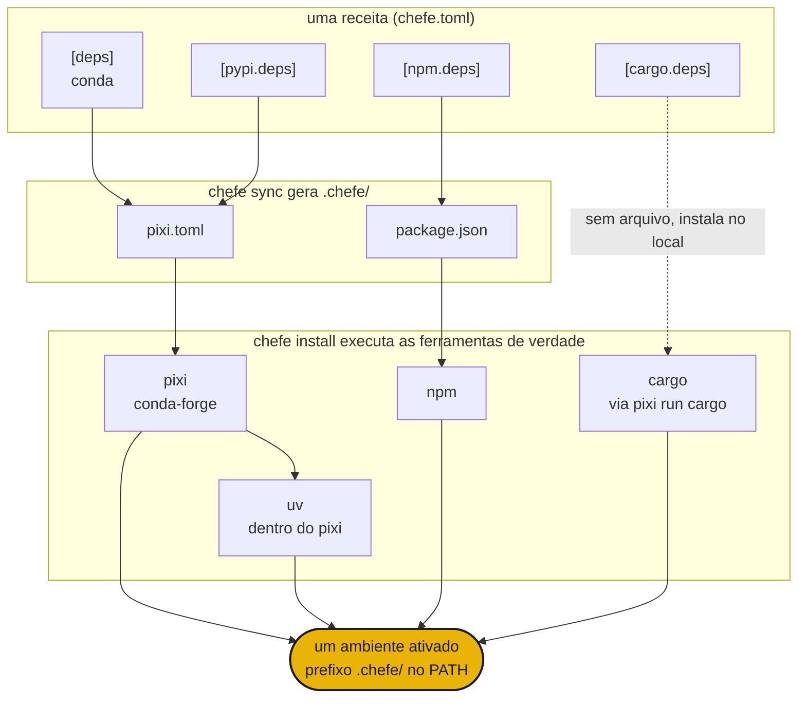

# chefe

Um manifest para cada gerenciador de pacotes

## Instalação

```sh
curl -fsSL https://phvv.me/chefe/install.sh | sh
```

Isso instala o [pixi](https://pixi.sh) (o motor para o qual o chefe compila) e o próprio chefe. Prefere o pacote puro? Use `pip install chefe` ou `uv tool install chefe`.

## O que é

Conda, PyPI, npm, cargo. Projetos reais precisam de vários ao mesmo tempo, espalhados entre `pixi.toml`, `package.json` e `Cargo.toml`. O chefe é o chefe de cozinha. Você escreve **uma única receita `chefe.toml`**, ele compila cada manifest nativo em `.chefe/`, executa as ferramentas de verdade e serve tudo como um único ambiente. Ele nunca reimplementa um solver. Ele comanda os cozinheiros.

<div class="grid cards" markdown>

- :material-silverware-variant: **Uma receita**

    Todo ecossistema em um único `chefe.toml`. Chega de fazer malabarismo com quatro manifests.

- :material-cog-transfer-outline: **Saída nativa**

    Compila para `pixi.toml`, `package.json` e companhia de verdade. As ferramentas reais fazem a resolução.

- :material-source-branch: **Combinável**

    Sobreposições por plataforma e ambientes nomeados se empilham como features do pixi.

- :material-broom: **Autocontido**

    Todo o ambiente vive em `.chefe/`, então basta um único comando para apagá-lo.

</div>

!!! warning "chefe é recente (`0.0.x`)"
    O formato do manifest e os comandos ainda podem mudar.

## Início rápido

```sh
chefe init                 # scaffold a chefe.toml
chefe add ripgrep          # add deps, use --pypi / --cargo / --npm for others
chefe install              # provision every ecosystem at once
chefe tree                 # what's declared vs installed, per ecosystem
```

## Como tudo se encaixa



- A **estrutura** é validada pelo schema do chefe, enquanto as **especificações dos pacotes** continuam sendo tarefa de cada ferramenta.
- Editar o `chefe.toml` por meio de `chefe add` e `chefe remove` preserva seus comentários e formatação.
- O `pixi` (com o `uv` dentro dele) é o motor central para conda e PyPI, e os demais ecossistemas são camadas finas e explícitas por cima.

A seguir, a [referência do manifest](manifest.md) e a [referência de comandos](commands.md).

## Lore

Um chefe de cozinha nunca prepara cada prato sozinho. Ele escreve a receita e comanda a linha, e cada cozinheiro trabalha em sua estação. Gerenciadores de pacotes espalhados são essa linha, então o chefe os dirige a partir de uma única receita. 🧑‍🍳
