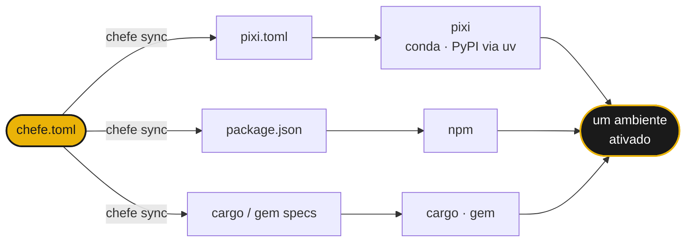

<div class="hero" markdown>

{ .hero-banner }

# chefe { .visually-hidden }

</div>

## Instalação

```sh
curl -fsSL https://phvv.me/chefe/install.sh | sh
```

Isso instala o [pixi](https://pixi.sh) (o motor para o qual o chefe compila) e o próprio chefe. Prefere o pacote bruto? Use `pip install chefe` ou `uv tool install chefe`.

## O que é

Conda, PyPI, npm, cargo. Projetos reais precisam de vários ao mesmo tempo, espalhados por `pixi.toml`, `package.json` e `Cargo.toml`. O chefe é o chef de cozinha principal. Você escreve **uma receita `chefe.toml`**, ele compila cada manifest nativo em `.chefe/`, executa as ferramentas reais e os serve como um único ambiente. Ele nunca reimplementa um resolvedor. Ele gerencia os cozinheiros.

<div class="grid cards" markdown>

- :material-silverware-variant: **Uma receita**

    Todo ecossistema em um único `chefe.toml`. Chega de lidar com quatro manifestos.

- :material-cog-transfer-outline: **Saída nativa**

    Compila para `pixi.toml`, `package.json` reais e afins. As ferramentas reais fazem a resolução.

- :material-source-branch: **Componível**

    Sobreposições de plataforma e ambientes nomeados são empilhados como recursos do pixi.

- :material-broom: **Autocontido**

    Todo o ambiente vive em `.chefe/`, então um comando o limpa.

</div>

!!! warning "O chefe está em estágio inicial (`0.0.x`)"
    O formato do manifest e os comandos ainda podem mudar.

## Início rápido

```sh
chefe init                 # cria a estrutura de um chefe.toml
chefe add ripgrep          # adiciona dependências, use --pypi / --cargo / --npm para outros
chefe install              # provisiona cada ecossistema de uma vez
chefe tree                 # o que está declarado vs instalado, por ecossistema
```

## Como tudo se encaixa



- A **estrutura** é validada pelo esquema do chefe, enquanto as **especificações de pacotes** continuam sendo trabalho de cada ferramenta.
- Editar o `chefe.toml` através de `chefe add` e `chefe remove` mantém seus comentários e formatação.
- O `pixi` (com `uv` dentro dele) é o motor profundo para conda e PyPI, e os outros ecossistemas são camadas finas e explícitas sobre ele.

A seguir, a [referência do manifest](manifest.md) e a [referência de comandos](commands.md).

## Lore

Um chef de cozinha nunca prepara todos os pratos sozinho. Ele escreve a receita e comanda a linha, e os cozinheiros trabalham em suas respectivas estações. Gerenciadores de pacotes espalhados são essa linha, então o chefe os direciona a partir de uma única receita. 🧑‍🍳