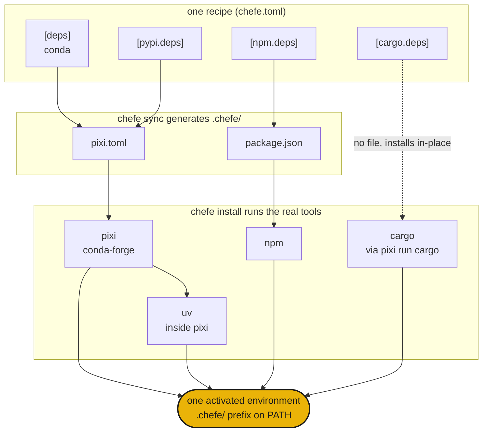

# chefe

一份 manifest，统管每个包管理器

## 安装

```sh
curl -fsSL https://phvv.me/chefe/install.sh | sh
```

这会安装 [pixi](https://pixi.sh)（chefe 编译到的底层引擎）以及 chefe 本身。只想要纯粹的包？用 `pip install chefe` 或 `uv tool install chefe`。

## 它是什么

Conda、PyPI、npm、cargo。真实项目常常同时用到好几个，散落在 `pixi.toml`、`package.json` 和 `Cargo.toml` 里。chefe 就是那位主厨：你只写**一份 `chefe.toml`** 食谱，它就在 `.chefe/` 下编译出各个原生 manifest，调用真正的工具，再把它们摆盘成单一环境。它从不自己实现求解器，只负责指挥这些厨师干活。

<div class="grid cards" markdown>

- :material-silverware-variant: **一份食谱**

    所有生态系统都汇集到一个 `chefe.toml`。再也不用同时倒腾四份 manifest。

- :material-cog-transfer-outline: **原生输出**

    编译为真正的 `pixi.toml`、`package.json` 等文件。真实的工具负责求解。

- :material-source-branch: **可组合**

    平台叠加层和具名环境可以像 pixi 的 feature 一样层层叠加。

- :material-broom: **自包含**

    整个环境都放在 `.chefe/` 里，因此一条命令就能彻底清除。

</div>

!!! warning "chefe 尚处早期（`0.0.x`）"
    manifest 格式和命令仍可能变化。

## 快速上手

```sh
chefe init                 # scaffold a chefe.toml
chefe add ripgrep          # add deps, use --pypi / --cargo / --npm for others
chefe install              # provision every ecosystem at once
chefe tree                 # what's declared vs installed, per ecosystem
```

## 它们如何协作



- **结构**由 chefe 的 schema 校验，而**包规格**始终交给各工具自己处理。
- 用 `chefe add` 和 `chefe remove` 编辑 `chefe.toml` 时，会保留你的注释和格式。
- `pixi`（内嵌 `uv`）是处理 conda 和 PyPI 的底层引擎，其他生态系统则是叠加其上的轻量、显式的薄层。

接下来请看 [manifest 参考](manifest.md) 和 [命令参考](commands.md)。

## 典故

主厨从不独自做完每道菜。他写好食谱、统领整条出菜线，让每位厨师各守一岗。散落的包管理器就是这条出菜线，而 chefe 用一份食谱把它们统一调度起来。🧑‍🍳
