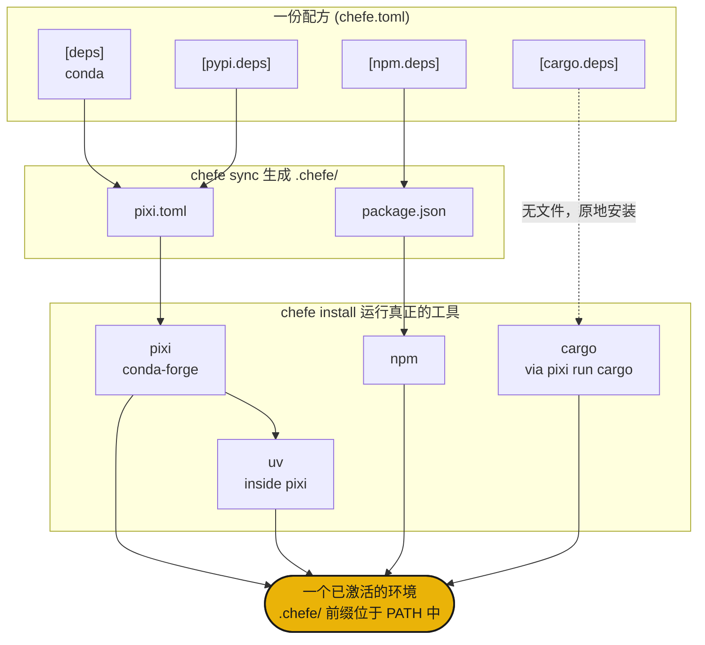

<div class="hero" markdown>

{ .hero-banner }

# chefe { .visually-hidden }

</div>

## 安装

```sh
curl -fsSL https://phvv.me/chefe/install.sh | sh
```

这将安装 [pixi](https://pixi.sh)（chefe 编译所依赖的引擎）以及 chefe 本身。更倾向于使用原始包？请使用 `pip install chefe` 或 `uv tool install chefe`。

## 它是什么

Conda、PyPI、npm、cargo。真实的项目往往需要同时使用多种工具，散落在 `pixi.toml`、`package.json` 和 `Cargo.toml` 中。chefe 是总厨。你只需编写**一份 `chefe.toml`** 配方，它就会在 `.chefe/` 下编译出每个原生的 manifest，运行真正的工具，并将它们整合为一个单一的环境。它从不重新实现解析器，而是指挥各个“厨师”工作。

<div class="grid cards" markdown>

- :material-silverware-variant: **一份配方**

    将所有生态系统整合在单一的 `chefe.toml` 中。无需再同时处理四个 manifest。

- :material-cog-transfer-outline: **原生输出**

    编译为真实的 `pixi.toml`、`package.json` 等文件。由实际的工具负责解析。

- :material-source-branch: **可组合**

    平台覆盖（Platform overlays）和命名环境可以像 pixi 的特性（features）一样叠加。

- :material-broom: **自包含**

    整个环境都位于 `.chefe/` 中，因此只需一条命令即可将其清除。

</div>

!!! warning "chefe 处于早期阶段 (`0.0.x`)"
    manifest 格式和命令仍可能发生变化。

## 快速入门

```sh
chefe init                 # 初始化一个 chefe.toml
chefe add ripgrep          # 添加依赖，使用 --pypi / --cargo / --npm 指定其他生态
chefe install              # 同时配置所有生态系统
chefe tree                 # 查看每个生态系统的声明与安装情况
```

## 它是如何协同工作的



- **结构**由 chefe 的 schema 进行验证，而**包规范**则保留为每个工具的职责。
- 通过 `chefe add` 和 `chefe remove` 编辑 `chefe.toml` 可以保留你的注释和格式。
- `pixi`（内置 `uv`）是 conda 和 PyPI 的底层引擎，而其他生态系统则是其上层轻量且显式的封装。

接下来，请参阅 [manifest 参考](manifest.md) 和 [命令参考](commands.md)。

## 背景故事

总厨从不独自烹饪每一道菜。他们编写配方并管理生产线，由各岗位的厨师负责烹饪。分散的包管理器就是那条生产线，因此 chefe 通过一份配方来指挥它们。🧑‍🍳